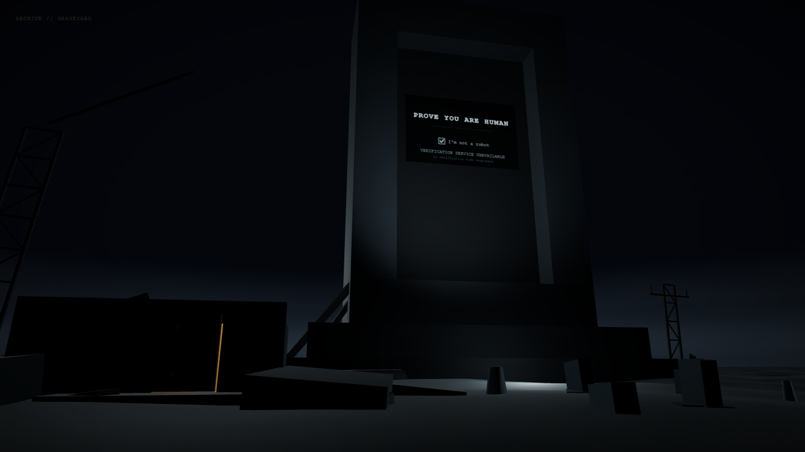
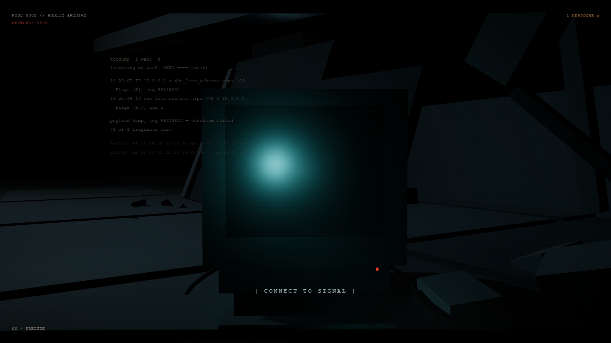
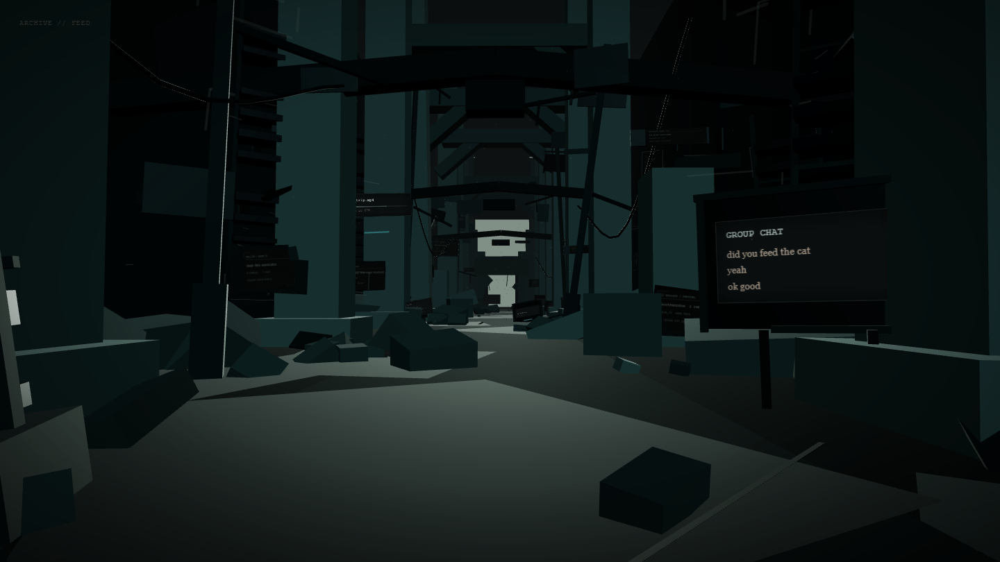
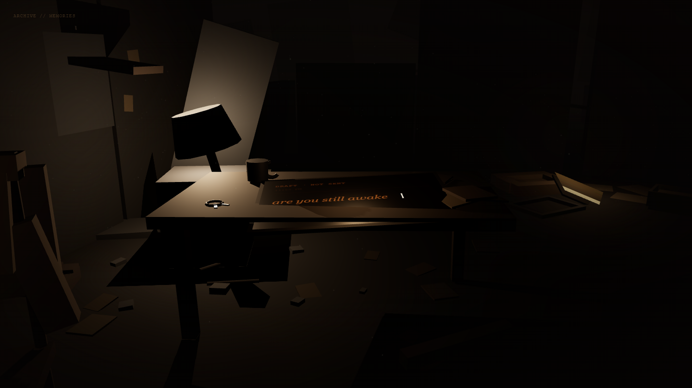
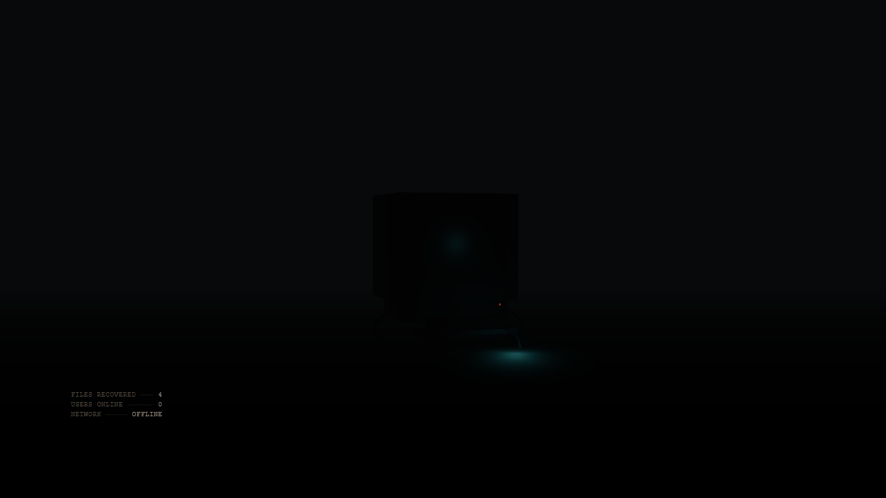

<p align="center">
  
</p>

<p align="center"><em>The internet died. One page remained.</em></p>

<p align="center">
  <a href="https://the-last-website-beta.vercel.app/"><strong>→ Enter the archive</strong></a>
</p>

<p align="center">
  
</p>

<p align="center"><sub>The Graveyard — the machine still asking for a human, with nothing left to answer it.</sub></p>

---

## The Experience

One server outlived the internet. It holds a partial, corrupted archive of ordinary human life, and it has been rebuilding its index for three thousand eight hundred and twenty-two days. You arrive as the first connection it has seen in that time, and you move through what it managed to keep.

The archive is not a museum of technology. What survived is not the platforms — it's a group chat about whether the cat was fed, a voicemail that says *it's not urgent*, a draft that was never sent. The infrastructure is wreckage. The people are still legible inside it.

It is a linear, progression-driven experience with a fixed emotional arc. There is no free roam, no inventory, no score, and nothing to win. You go forward, the archive shows you what it has, and then the connection ends.

> The internet didn't preserve history. It preserved people.

---

## The Journey

<p align="center">
  <code>Prelude → Feed → Graveyard → Memories → Last Message</code><br />
  <sub>Uncertainty → Recognition → Desolation → Intimacy → Absence</sub>
</p>

**Prelude** — You wake on the floor of a collapsed room. One damaged console still has power. A dead network signal resolves into a single recovered fragment, then a recovery process wakes underneath it, then a document written by someone called a.kaplan: *IF ANYONE FINDS THIS—*. The rest is unrecoverable. You choose to enter the archive.

**The Feed** — A long nave of broken information infrastructure: terminal stacks, fallen billboards, cable runs, overhead structure you pass beneath. Ordinary human conversation surfaces on the wreckage — recovered, fragmentary, and mundane enough to be real.

**The Graveyard** — Open ground under a low sky, where the old web is buried in rows: *under construction, never finished*; *guestbooks, sign before you go*. A monument stands over the field: an enormous CAPTCHA asking you to prove you are human. You tick the box. The verification service is not there any more. Beside it, a door you hadn't noticed shows a thin line of warm light — the first warmth in the entire experience.

**Memories** — Down the stairwell, a small room at human scale. A desk lamp still on, a mug, an unsent draft that reads *are you still awake*, an answering machine holding a message someone meant to return. Everything here was left by a person who expected to come back. Then the light goes out.

**The Last Message** — One terminal, alone, in a space that has stopped. `FILES RECOVERED: 4. USERS ONLINE: 0. NETWORK: OFFLINE.` The finale plays on its own — a last line, a deliberate silence, blackout, `CONNECTION LOST`, and the thesis, once. Then `[ RECONNECT ]`, and the archive begins again.

<table>
  <tr>
    <td width="50%"><br /><sub><b>Prelude</b> — one surviving system, and a signal that is nearly gone.</sub></td>
    <td width="50%"><br /><sub><b>The Feed</b> — a group chat, recovered intact, about nothing.</sub></td>
  </tr>
  <tr>
    <td width="50%"><br /><sub><b>Memories</b> — a draft, still open, never sent.</sub></td>
    <td width="50%"><br /><sub><b>The Last Message</b> — files recovered: 4. Users online: 0.</sub></td>
  </tr>
</table>

---

## Interaction

**Move forward** with the mouse wheel or a trackpad scroll — or, on touch, by dragging vertically. Progression is one-directional and the camera is authored: you control how fast you travel through the archive, never where you point. Three of the five scenes work this way; the Prelude and the Last Message are not scroll-driven and play on their own timing.

**Act** at the few moments the archive asks you to: connecting to the signal and entering the archive in the Prelude, ticking the CAPTCHA in the Graveyard, and reconnecting at the end. Each is a real, focusable control as well as a thing in the world, so the whole sequence can be completed from the keyboard.

**Accessibility** is part of the scene architecture rather than a layer on top of it. Every scene carries a live narration of its visual-only beats for screen readers, and `prefers-reduced-motion` is honoured throughout — camera movement is dropped rather than merely shortened, while the narrative order, the readable holds and every required interaction are preserved.

**Sound** is one continuous, restrained soundtrack. It starts from your own connect gesture, stays running across every scene change, and drains away into silence before the ending — so the last minutes play in the quiet they were written for.

---

## Built With

- [React 19](https://react.dev/) — application shell and scene ownership
- [Vite 8](https://vitejs.dev/) — build and dev server
- [Three.js](https://threejs.org/) — rendering
- [React Three Fiber](https://docs.pmnd.rs/react-three-fiber) — declarative scene composition
- [Drei](https://github.com/pmndrs/drei) — R3F helpers
- [GSAP](https://gsap.com/) — discrete authored beats: phase timing, finale sequencing, entrance and exit timing
- Native browser audio — one `HTMLAudioElement`, no audio framework
- [Playwright](https://playwright.dev/) — render and transition verification during development

No global state library, no post-processing stack, no backend. The archive is built almost entirely from procedural R3F geometry — the one modelled asset is a small six-piece grave-marker kit used to populate the Graveyard.

---

## Design Philosophy

- **The world is the interface.** No HUD, no nav bar, no objective markers, no tutorial chrome.
- **Restraint over spectacle.** Atmosphere comes from composition, scale, negative space, fog, silence and pacing — not from bloom and glitch.
- **Ordinary over epic.** An unsent draft and *see you tomorrow* carry more than any lore would.
- **One writer per value.** The scene's camera component is the sole continuous authority over the camera; GSAP times discrete beats and never fights the render loop for the same property.
- **Each scene keeps its own character.** The five scenes are deliberately not interchangeable — different density, different color language, different camera behaviour, different ways of handing over to the next.
- **The thesis is earned.** Inside the experience it appears exactly once, at the very end, and never as a preface.

---

## Running Locally

```bash
git clone https://github.com/Far-200/the-last-website.git
cd the-last-website
npm install
npm run dev
```

```bash
npm run build     # production build
npm run preview   # serve the production build
npm run lint      # lint the source
```

No environment variables are required. There is no test script in this repository.

The full design contract — thesis, emotional arc, area breakdown, non-goals and restraint rules — lives in [`docs/PROJECT_PLAN.md`](./docs/PROJECT_PLAN.md).

---

## Credits

The environments, terminal copy and recovered fragments in the archive were written and built for this project.

The soundtrack is *Melancholic* by Monume, used under the Pixabay Content License. Full asset attribution — including the Graveyard's grave-marker kit — is in [`docs/CREDITS.md`](./docs/CREDITS.md).

Built on open-source work by others: React, Vite, Three.js, React Three Fiber, Drei and GSAP.

---

<p align="center"><sub>Scroll to the end and the archive offers to start again. It always has more time than you do.</sub></p>
