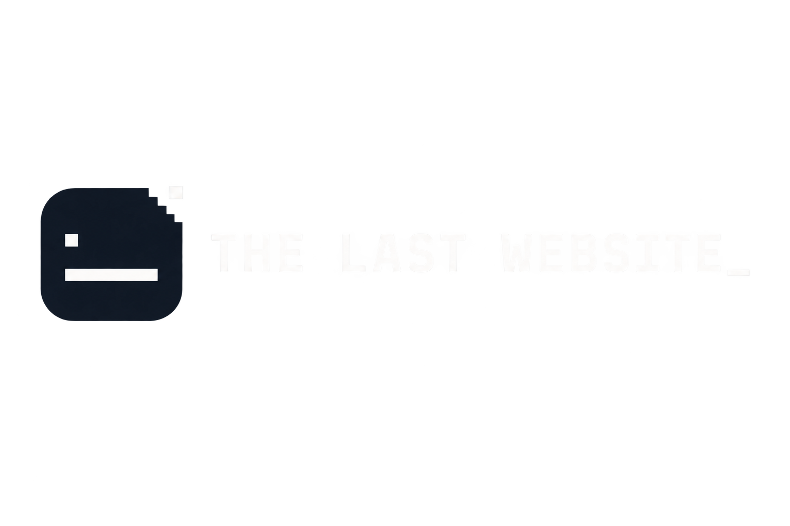

<p align="center">
  
</p>

<p align="center"><em>The internet died. One page remained.</em></p>

---

## Overview

**The Last Website** is a guided interactive narrative built with React Three Fiber. One server survived the death of the internet, containing a corrupted archive of ordinary human life, and the visitor moves through its remaining fragments before the connection finally disappears.

It is not a game, not a free-roam world, not a nostalgia clip show, and not a portfolio site wearing a 3D skin. It's a linear, scroll/progression-driven experience with a fixed emotional arc:

```
Uncertainty → Recognition → Desolation → Intimacy → Absence
```

The internet didn't preserve history. It preserved people.

---

## Current Status

```
Current milestone: Day 1 — Foundation
Status: ✅ Complete
```

Confirmed working locally:

- Vite + React foundation
- React Three Fiber `<Canvas>` mounted and rendering
- One rotating placeholder cube with basic lighting (proof that R3F is wired correctly — not part of the final experience)
- Core dependencies installed
- Project folder skeleton in place
- Successful local production build

Next planned milestone: **Day 2 — progression state + camera rig skeleton.**

This project is being built on an active daily roadmap. The scenes described below are planned, not yet implemented.

---

## Planned Experience

The intended visitor journey, in order:

1. **Connection Prelude** — a single terminal prompt, a click to connect
2. **The Feed** — a broken data-stream corridor of suspended fragments
3. **The Graveyard** — ruins of the old web, centered on the CAPTCHA monolith
4. **Memories** — an archive of warm, ordinary human fragments
5. **The Last Message** — one surviving terminal, alone in the dark

None of these areas are playable yet. Day 1 contains only the technical foundation described above.

---

## Technology

**In use:**

- [React](https://react.dev/)
- [Vite](https://vitejs.dev/)
- [Three.js](https://threejs.org/)
- [React Three Fiber](https://docs.pmnd.rs/react-three-fiber)
- [Drei](https://github.com/pmndrs/drei)
- [GSAP](https://gsap.com/)

**Planned, not yet implemented:**

- **Zustand** — progression/state management, planned for Day 2
- **Web Audio API** — ambient sound and interaction cues, planned for Day 4

---

## Local Development

```bash
git clone https://github.com/Far-200/the-last-website.git
cd the-last-website
npm install
npm run dev
```

Other available commands:

```bash
npm run build   # produces a production build
npm run lint    # runs the linter against the source
```

No environment variables are required at this stage.

---

## Project Structure

```
the-last-website/
├── docs/
├── public/
├── src/
│   ├── assets/
│   ├── audio/
│   ├── components/
│   ├── data/
│   ├── hooks/
│   ├── scenes/
│   ├── state/
│   ├── styles/
│   └── three/
├── README.md
├── package.json
└── vite.config.js
```

---

## Project Plan

The full execution contract — design principles, area-by-area breakdown, technical budget, and the day-by-day build roadmap — lives at [`docs/PROJECT_PLAN.md`](./docs/PROJECT_PLAN.md). This README will be expanded and finalized as the project approaches submission; the project plan is the source of truth in the meantime.

---

## Design Philosophy

A few constraints guide every decision:

- The world is the interface — no persistent HUD, no nav bar competing with the fiction.
- A visitor who does nothing but progress still gets the complete story.
- Restraint over spectacle. Effects are seasoning, not the dish.
- The thesis is earned, not announced — it appears once, at the end, never as a preface.

---

## Credits

Third-party assets, if any are used, will be tracked in [`docs/CREDITS.md`](./docs/CREDITS.md) as the project develops.
